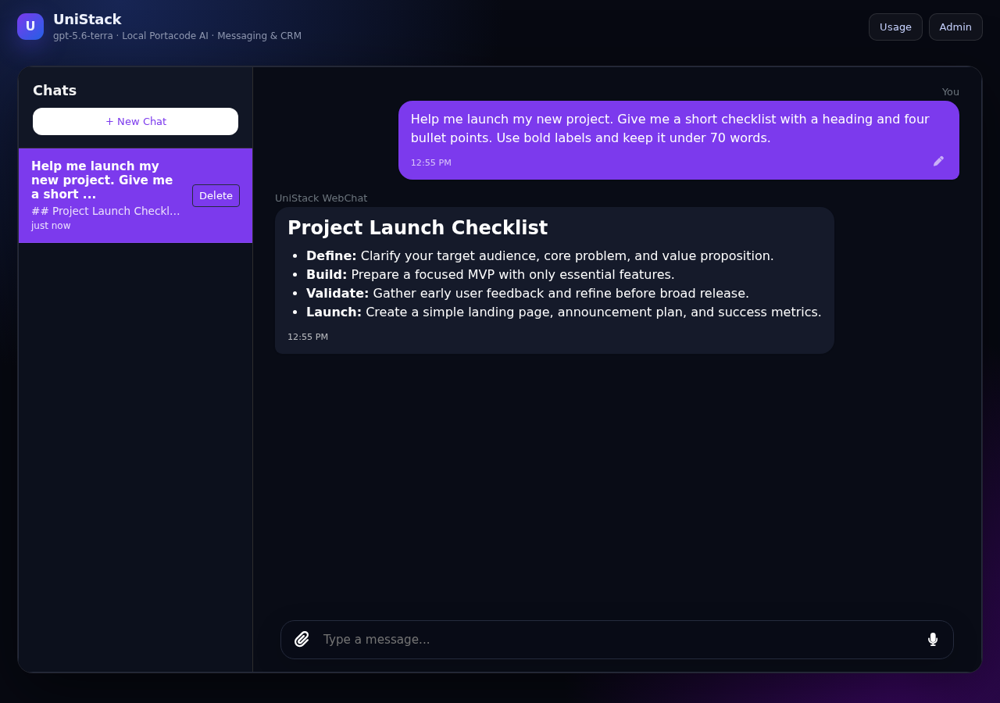
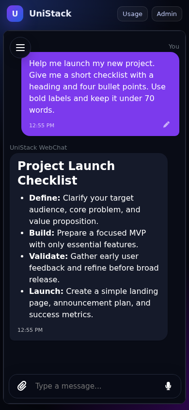

# UniStack

Start your own Django project with a polished AI chat, messaging, and CRM.
The demo includes streamed Markdown replies, conversation history, image
attachments, a mobile composer, and per-conversation AI usage.

[](https://portacode.com/dashboard/?portafile=data%3Atext%2Fyaml%3Bcharset%3Dutf-8%2Csource_template%253A%2520ubuntu%250Aname%253A%2520UniStack%250Ahostname%253A%2520unistack%250Ausername%253A%2520root%250Arequires_codex_connection%253A%2520true%250Aresources%253A%250A%2520%2520disk_gib%253A%252012%250A%2520%2520ram_mib%253A%25203072%250A%2520%2520cpus%253A%25202%250Ainputs%253A%250A%2520%2520-%2520id%253A%2520project_slug%250A%2520%2520%2520%2520type%253A%2520text%250A%2520%2520%2520%2520label%253A%2520Project%2520name%250A%2520%2520%2520%2520required%253A%2520false%250A%2520%2520%2520%2520default%253A%2520my-project%250A%2520%2520%2520%2520description%253A%2520Optional%2520folder%2520name%252C%2520such%2520as%2520my-app.%2520Use%2520lowercase%2520letters%252C%2520numbers%252C%2520and%2520hyphens.%250A%2520%2520-%2520id%253A%2520django_superuser_username%250A%2520%2520%2520%2520type%253A%2520text%250A%2520%2520%2520%2520label%253A%2520Django%2520admin%2520username%250A%2520%2520%2520%2520required%253A%2520true%250A%2520%2520%2520%2520default%253A%2520admin%250A%2520%2520%2520%2520description%253A%2520Username%2520for%2520the%2520initial%2520Django%2520superuser.%250A%2520%2520-%2520id%253A%2520django_superuser_email%250A%2520%2520%2520%2520type%253A%2520email%250A%2520%2520%2520%2520label%253A%2520Django%2520admin%2520email%250A%2520%2520%2520%2520required%253A%2520true%250A%2520%2520%2520%2520description%253A%2520Email%2520address%2520for%2520the%2520initial%2520Django%2520superuser.%250A%2520%2520-%2520id%253A%2520django_superuser_password%250A%2520%2520%2520%2520type%253A%2520secret%250A%2520%2520%2520%2520label%253A%2520Django%2520admin%2520password%250A%2520%2520%2520%2520required%253A%2520true%250A%2520%2520%2520%2520description%253A%2520Password%2520for%2520the%2520initial%2520Django%2520superuser.%250Aautomation_task%253A%250A%2520%2520task_name%253A%2520Deploy%2520UniStack%250A%2520%2520instructions%253A%250A%2520%2520%2520%2520-%2520run%253A%2520docker%2520compose%2520version%250A%2520%2520%2520%2520-%2520run%253A%2520portacode%2520github-setup%250A%2520%2520%2520%2520-%2520run%253A%2520git%2520clone%2520--recurse-submodules%2520https%253A%252F%252Fgithub.com%252Fportacode%252FUniStack.git%2520%2522%2524HOME%252F.unistack-template%2522%2520%2526%2526%2520python3%2520%2522%2524HOME%252F.unistack-template%252Fscripts%252Fcreate_project.py%2522%250A%2520%2520%2520%2520-%2520run%253A%2520cd%2520%2522%2524HOME%252F%2524%257BPROJECT_SLUG%253A-my-project%257D%2522%2520%2526%2526%2520.%252Fscripts%252Fdeploy.sh%250A%2520%2520%2520%2520-%2520run%253A%2520cd%2520%2522%2524HOME%252F%2524%257BPROJECT_SLUG%253A-my-project%257D%2522%2520%2526%2526%2520docker%2520compose%2520exec%2520-T%2520web%2520python%2520scripts%252Fensure_superuser.py%250A%2520%2520%2520%2520-%2520wait_for%253A%2520https%253A%252F%252F%255Bexposed%253A8000%255D%252Fhealth%252F%250A%2520%2520%2520%2520%2520%2520timeout%253A%25201200%250A%2520%2520%2520%2520-%2520run%253A%2520cd%2520%2522%2524HOME%252F%2524%257BPROJECT_SLUG%253A-my-project%257D%2522%2520%2526%2526%2520test%2520%2521%2520-e%2520.git%2520%2526%2526%2520pwd%2520-P%250A%2520%2520%2520%2520%2520%2520register_project%253A%2520true%250A%2520%2520expose_ports%253A%250A%2520%2520%2520%2520-%25208000%250A%2520%2520on_success%253A%2520notify%250A%2520%2520on_failure%253A%2520suggest_fixes%250A)

**Click the button, choose an optional project name, and enter your admin
credentials.** Portacode provisions the environment and deploys everything
automatically. When it finishes, open the app link, sign in, and start chatting.
The local Portacode AI connection is configured for you.

Your project lives in your home directory under the name you chose, or
`my-project` if you leave the name blank. It is marked as a Portacode project
after the folder has been renamed and deployment has succeeded. The template's
Git history is removed so you can connect your own repository later; the
upstream app repositories retain their history.

## See the demo

Desktop chat with Markdown replies and a conversation sidebar:

The same conversation on mobile:

Conversations and streamed replies persist through reloads. Attach an image
to ask about it, select **Usage** to see reported tokens, or open **Admin**
to explore UniCom, UniBot, and UniCRM.

## Build your project

- `core/`: your application features and project integration.
- `config/`: Django settings and routing.
- `data/definitions/`: source-defined bots and tools, synced on deployment.
- `apps/`: the reusable messaging, bot, and CRM apps.

For development and maintenance, see [the technical notes](docs/development.md).
Exact upstream versions are recorded in [application provenance](VENDORED_APPS.md).
